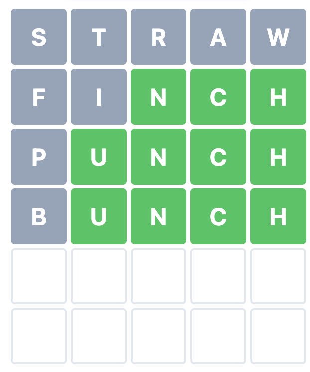

# Python Script to Find Best Words for Wordle

## Overview

If you ever play Wordle and become frustrated when being unable to think of a suitable word given the clues you've gathered up to that point, this script will provide a list of possible words.

Beyond just giving you a list of potential words, the script will also rank words according to their efficiency (explained in more detail below).

The script also offers a mode for what I call "sacrifice words." Sacrifice words are guesses that you know cannot be the correct answer given your clues, but you elect to sacrifice one of your six guesses in order to eliminate possibilities.

### The dataset

The dataset contains 14,855 five-letter words from [this repo](https://github.com/tabatkins/wordle-list), whose README says they come directly from Wordle's source code.

Keep in mind, however, that the majority of these words in this dataset are obscure. While Wordle will likely accept them all as valid words, the majority are unlikely to be a daily answer. Likewise, Wordle doesn't seem to ever choose as answers four-letter nouns in their plural forms (such as CARDS) or four-letter verbs in their third-person present forms (such as TAKES).

The results of running this script are cross-checked against a list of 2,315 possible daily answers found [here](https://github.com/Kinkelin/WordleCompetition/blob/main/data/official/shuffled_real_wordles.txt).


## How to Use the Script
### Running the Script
1. Clone the github repo to your local machine with Python installed.
2. In a code or text editor, add the clues you've gathered in the `variables.py` file.
3. In the repo's directory on the command line, run `python3 wordle.py`, and the output will appear in the terminal.

## Using the `variables.py` file
### Letters

The top part of `variables.py` has three variables when you start:

```py
letters_not_in_answer = ''
green = ''
yellow = ''
```

Suppose this is your Wordle situation:


You would alter the file according to which letters are not in your answer and the slots of the green and yellow letters.

Several letters are gray, and there's a green E in slot 4 and a green R in slot 5. There are yellow R's in slots 1 and 2, E's in slots 3 and 5, and an F in slot 3.

```py
letters_not_in_answer = 'aistndgo'
green = 'e4, r5'
yellow = 'r12, e35, f3'
```
Save the `variables.py` file. When you run `python3 wordle.py`, the following will appear in the terminal:

```
1. flyer 17.6871% ✓
2. fumer 17.0068%
2. feyer 17.0068%
4. fever 16.3265% ✓
4. fewer 16.3265% ✓
6. ferer 15.6463%
```

These are the remaining possible words to choose from that will be accepted as valid words. The words with a check mark are also possible daily answers.  

### Letter Format

When entering these variables, you can use capital letters for `letters_not_in_answer` if you prefer and don't have to worry about accidentally repeating any. For `green` and `yellow`, you can also use capital letters and can combine or split up the letters and the slots as you see fit. For example, the following are equivalent:

* `yellow = 'r12, e35, f3'`
* `yellow = 'f3, R21, E3, e5'`

Just make sure each letter/slot pair is separated by a comma and a space.

### Limit output

The `limit` variable accepts an integer, and it will limit the amount of words displayed by the terminal.

`limit = 25` will display only the top 25 words in the terminal.
`limit = None` will display all words from the query.

### Weighing the scoring methods

This script uses two functions to score the resuts of the query, `efficiency_elimination` and `efficiency_slot`.

The `elim_weight` variable in the `variables.py` takes a number between 0 and 1. If `elim_weight = 1`, the script will assign full weight to the elimination function. If `elim_weight = 0`, the script will assign full weight to the slot function. If `elim_weight = .5`, the script will assign equal weight to the two functions.

## About the scoring methods

The `efficiency_elimination` function determines which letters are most common in the remaining words after the green, yellow, and not-in-answer letters are assigned.

For example, if you run the script on the full dataset without assigning any green, yellow, or not-in-answer letters and with `limit = 20` and with `elim_weight = 1`, the output will be:

```
1. soare 0.0108%
1. arose 0.0108% ✓
1. aeros 0.0108%
4. raise 0.0106% ✓
4. arise 0.0106% ✓
4. serai 0.0106%
4. reais 0.0106%
4. aesir 0.0106%
4. seria 0.0106%
10. stoae 0.0105%
10. toeas 0.0105%
10. alose 0.0105%
10. aloes 0.0105%
14. lears 0.0104%
14. arles 0.0104%
14. seral 0.0104%
14. laser 0.0104%
14. laers 0.0104%
14. lares 0.0104%
14. neosa 0.0104%
```

The words SOARE, AROSE, and AEROS are at the top. Choosing one of these words for the next guess has the highest chance of eliminating the most words in the dataset because they contain the most frequent letters. (If a word has a repeated letter, the function will not consider the repeat in its scoring.) The elimination function does not take into account where any letters appear in the word.

Meanwhile, the `efficiency_slot` function determine which letters are most common in each slot of the dataset and scores the words accordingly.

For example, if you run the script on the full dataset without assigning any green, yellow, or not-in-answer letters and with `limit = 20` and with `elim_weight = 0`, the output will be:

```
1. sanes 0.0133%
1. sores 0.0133%
3. sales 0.0132%
4. pares 0.013%
4. sones 0.013%
6. bares 0.0129%
6. soles 0.0129%
6. sates 0.0129%
9. panes 0.0128%
9. mares 0.0128%
9. cares 0.0128%
9. sames 0.0128%
13. rares 0.0127%
13. pores 0.0127%
13. tares 0.0127%
13. seres 0.0127%
17. bores 0.0126%
17. manes 0.0126%
17. banes 0.0126%
17. canes 0.0126%
```

Notice how all the top words have an E in the fourth slot and an S in the fifth slot. The function determined these letters to be the most common in these positions.

In practicality, the top-ranked SANES would not be a good first choice to start a Wordle game because it wastes a slot by using an S twice. I find it's best to use `elim_weight = 1` or `.9` towards the beginning of a game and then adjust the weight as the game progresses.

## Sacrfice words

Suppose you have the following situation:



There are two guesses left, but the answer would likely be one of the following three:

* LUNCH
* MUNCH
* HUNCH

In order not ensure not running out of turns and losing, a strategy would be to find a word with the letters L, M, and H in it to get a clue as to what the first letter of the answer is.

In `variables.py`, change `sacrifice_mode = False` to `sacrifice_mode = True` and assign `sacrifice_word_letters` to "hml":

``` py
sacrifice_mode = True
sacrifice_word_letters = 'hml'
sacrifice_unique_letter_positions = ''
```

When you run `wordle.py`, the top 10 output is:

```
1. mahal - 3 points
1. whelm - 3 points
1. haulm - 3 points
1. lymph - 3 points
1. holms - 3 points
1. halma - 3 points
1. helms - 3 points
1. milch - 3 points
1. almah - 3 points
1. mulsh - 3 points
```

In this sacrifice mode, the scoring awards one point to each letter found in the word. All these words have an L, an M, and an H so they all receive 3 points.

But the first word MAHAL wouldn't be a good pick in this situation. It has an H in position 3, but we know the answer already has an H in position 5, so entering MAHAL as a guess will automatically have a yellow H and not give us a meaningful clue about whether the word has two H's.

To account for such a situation, use the `sacrifice_unique_letter_positions` variable, assigning it the letter and the desired slot to reveal. In this case, we want to know if there's an H in position 1 in case the answer is HUNCH.

``` py
sacrifice_mode = True
sacrifice_word_letters = 'ML'
sacrifice_unique_letter_positions = 'h1'
```

Now the top output is:

```
1. haulm - 3 points
1. holms - 3 points
1. halma - 3 points
1. helms - 3 points
1. hamel - 3 points
1. hamal - 3 points
1. holme - 3 points
1. hilum - 3 points
1. hemal - 3 points
1. halms - 3 points
11. mamil - 2 points
11. limas - 2 points
11. almud - 2 points
11. samel - 2 points
11. mahal - 2 points
11. mazel - 2 points
```
For the words with three points, they get one point for each appearing `sacrifice_word_letters` and one point for each `sacrifice_unique_letter_positions`. Notice how in this situation, MAHAL only receives 2 points.

### Entering the variables
* In sacrifice mode, `sacrifice_word_letters` cannot be empty.
* Enter either capitals or lowercase.
* Multiple items `sacrifice_unique_letter_positions` need to separated by a comma and a space. If you have the same letter in more than one position, they need to be separated out. For example:

``` py
sacrifice_mode = True
sacrifice_word_letters = 'ae'
sacrifice_unique_letter_positions = 't1, t5'
```


