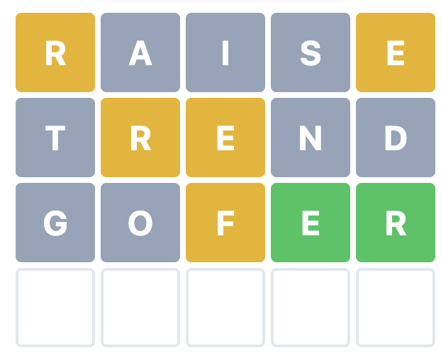

# Python Script to Find Best Words for Wordle

## Overview

If you ever play Wordle and become frustrated when being unable to think of a word that will work given the clues you have been given up to that point, this script will provide a list of possible words.

Beyond just giving you a list of potential words, the script will also rank words according to their "efficiency" (explained in more detail below).

The script also offers a mode for what I call "sacrifice words." Sacrifice words are words that you know cannot be the correct answer given your clues, but you elect to sacrifice one of your six guesses in order to eliminate a large amount of possibilities.

## How to Use the Script
### Running the Script
1. Clone the github repo to your local machine with Python installed.
2. In a code or text editor, add the clues you've gathered in the `variables.py` file.
3. In the correct directory on the command line, run `python3 wordle.py`, and the output will appear in the terminal.

## Using the `variables.py` File

The top part of `variables.py` has three variables when you start:

```py
letters_not_in_answer = ''
green = ''
yellow = ''
```

Suppose this is your Wordle situation:



So you would alter the file according to what the letters are in your puzzle and the slots of the green and yellow letters. Here there are several letters that aren't in the puzzle. Also, there's a green "E" in slot 4 and a green "R" in slot 5. There is a yellow "R" in slots 1 and 2, "E" in slots 3 and 5, and "F" in slot 3.

Enter a comma and a space between multiple entries:

```py
letters_not_in_answer = 'aistndgo'
green = 'e4, r5'
yellow = 'r12, e35, f3'
```


_Not Yet Finished_